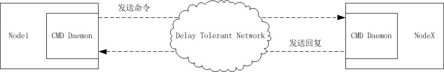

# ION
ION with IPv6 

## Testcases

 * [config_files/nodex.conf](config_files/node1.conf): DTN routing algorithm testcase for IPv4 with 3 nodes
 * [config_files/ltp0x.conf](config_files/ltp01.conf): IPv6 testcase with 2 nodes
 * [config_files/ipv6-9nodes](config_files/ipv6-9nodes): DTN routing algorithm testcase for IPv6 with 9 nodes
  * [Testcase description and operating steps](document/ion-testcase.md)
  * [Description for generating script](document/ion-configgenerator.md)
  * [Script to generate configuration files](config_gen)
  * [Configuration files](config_files/ipv6-9nodes)

## Command Processor
 * [cmd_processor](cmd_processor)
 
